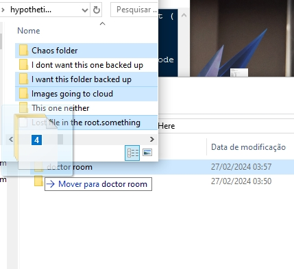

<h1>
  Logger for Computer Backup
  
</h1>

## Introduction
A python utility tool that will generate a .txt of all the files inside a folder called "doctor room"

Meant to assist in the task of backing up your computer to the cloud.

I have made this utility tool because I was going to upload a big part of my computer to multiple accounts in the cloud, and needed someway to know which things/files would be in which accounts.  
With the extreme high number of files it was obviously unfeasible to note by hand, so I had the idea to automatize the notation on a .txt.

The username/password generator is an extra. More about it below.

## Usage
- Download both scripts in a same folder
- Execute "BackupDoctor.py"
- If you already have a "doctor room" folder: Move your files and folder to it
- Provide the root path to "doctor room" and "records" folder (will be created if not there)
- Provide the path were the files were originally from
- If you did not had already a "doctor room" folder in this path: Move your files and folder there, then press enter to continue
- All your files will be logged inside "records" to a .txt with a username/password-like word in its name and first line
- Done

>[!TIP]
>If you want to skip the question everytime the script runs, you can hardcode it by:
>
>Commenting these lines
>```
>rootPath=input('Provide the path to create the "doctor room" and "records" folder.\n')
>originalFolder=input('To better help you remember.\nProvide the path from which these files were originally from:\n')
>```
>And uncommenting and hardcoding your paths in these lines
>```
>#rootPath=r'<Paste the path you want to create the folders here>'
>#originalFolder=r'<your\original\folder>'
>```

## Example
Given the folder below located at "C:\hypothetical Folder" and that you want to register them in a folder located at "C:\RegistrationHere", it would go as follows:


```
Provide the path to create the "doctor room" and "records" folder.
>>> C:\RegistrationHere
To better help you remember.
Provide the path from which these files were originally from:
>>> C:\hypothetical Folder
```
If the folder wasn't created already the program pause until you press enter to give you time to move the files


And everything would be logged. [See the result](Demo/RegistrationHere/records/thereWe31.txt) for this example here


# Extra: Text to Random username/password
It is a pretty simple code that will use the text inside it to generate random combinations of username/password.  
All non-alphanumeric characters will not be added  
The "BackupDoctor.py" uses this same file to generate its pairs

Run the file itself to generate 40 random combinations of user/password-like words. It does not do that when imported.

## Customizing the words used for username/password
You can easily tweak this by putting your own text inside the triple quotes of this variable:
```python
defaultText=('''We could not find enough words assoc*()`´[{]}~^;:,.<>/?°iated with Sheep, Sand, Lamb, Wolf.\n
Plea¨&se go back  %and $try an#other topic, or cont@inue to write@ a poem about missing.
      Someday, I may go to wander around the forest and hills, you know, just to get started on looking for these missing people,
      there is also a sheep of mine I really miss, the little lamb was eaten by the wolf
      repeated whole phrase 
      repeated whole phrase 
      repeated whole phrase 
      repeated whole phrase 
      repeated whole phrase 
      repeated whole phrase ''')
```
Do not fear repeating words and messing your random odds, it will add each unique word only once.
